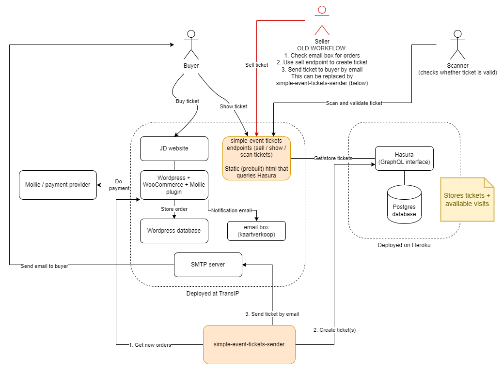

# Simple Event Tickets Sender
Emails event tickets to customers after placing a WooCommerce order.

## Description
 Simple Event Tickets Sender is a Nodejs application that queries the WooCommerce API of a Wordpress website for placed orders, generates a unique code for one or multiple tickets, adds corresponding entries to the ticket database (graphql) and sends emails to the customers with the link to their tickets.

## Example deployment overview



## Prerequisites
This application works together with the [Simple Event Tickets](https://github.com/kretep/simple-event-tickets) application. Go there for more information about the application and configuration of the Hasura database.

## Installation
Run the following in the project root:
```
npm install
```

## Configuration
Configuration is placed in a `.env` file in the project root. The following variables are required:

**WooCommerce API**
```
WOOCOMMERCE_API_URL=
WOOCOMMERCE_CONSUMER_KEY=
WOOCOMMERCE_CONSUMER_SECRET=
```

**Sending emails**
```
SMTP_HOST=
SMTP_PORT=
SMTP_LOGIN=
SMTP_PASSWORD=
SENDER_EMAIL=<email where the customer can reach you>
```

**Ticket database**

See jd-tickets repository for configuring the ticket database.
```
GRAPHQL_URL=<graphql endpoint>
HASURA_SELLER_TOKEN=<JWT for seller role>
```

## Usage
This runs the application once:
```
npm start
```
Set up a cron job that periodically runs the above.
